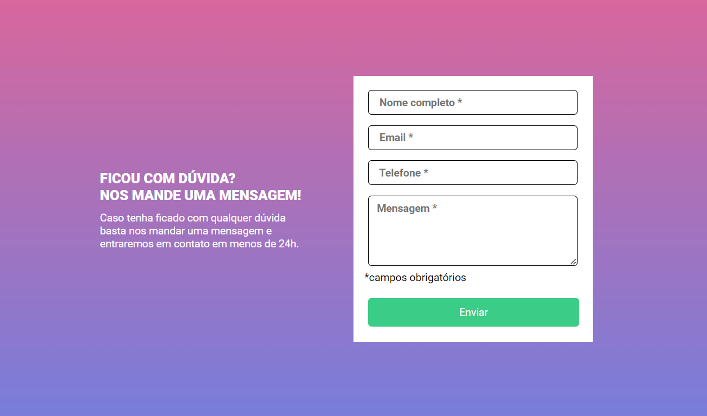
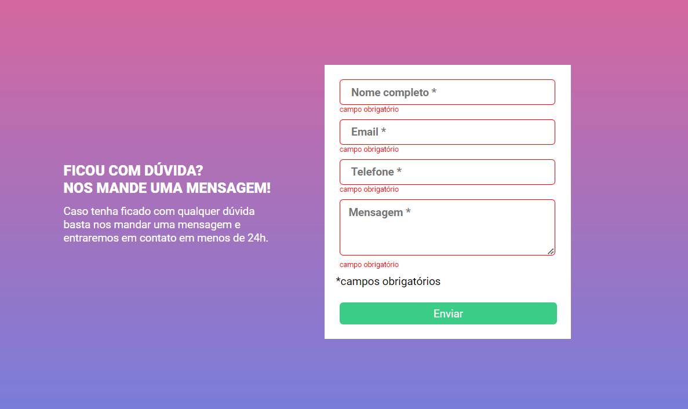
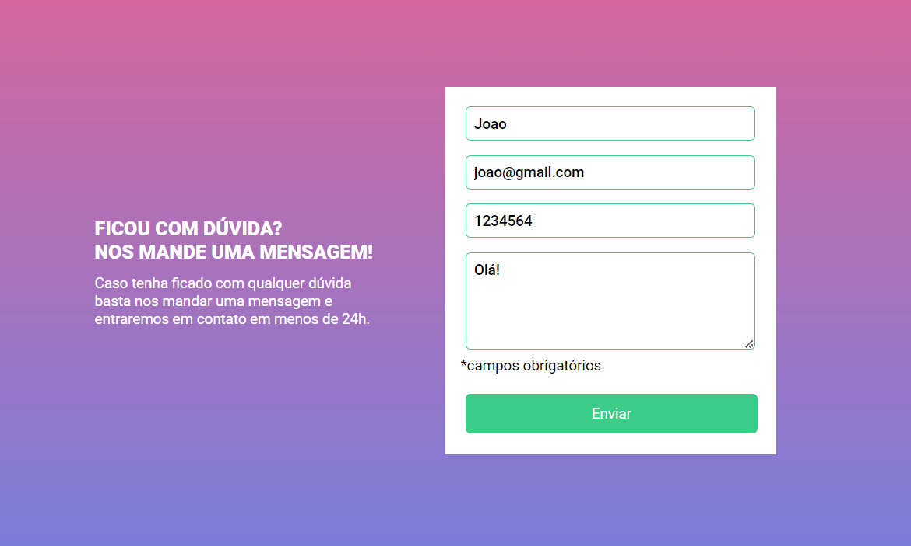

# Quest - intermédiaria de formulário com validação - Devquest

  
  

 

  
  

 

  
  

## O desafio

- A validação do formulário deve ser feita com
javascript puro.
- Ao clicar para enviar o formulário, se caso
algum campo não estiver preenchido, a borda
do input deve ficar vermelha e uma mensagem
de "campo obrigatório" deve aparecer embaixo
do campo que não foi preenchido, conforme o
figma.
- O fundo do formulário deve ser feito usando a
imagem em anexo na aula.

## Ferramentas

 
  
  
  

